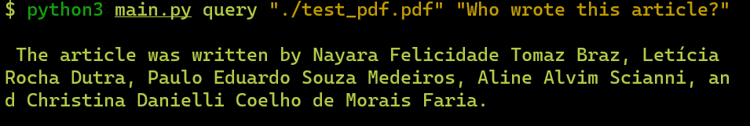

## PDF ChatGPT querying tool for the CLI :computer:

### In this project I created a simple CLI app that can take a query and find the answer in a given PDF file using GPT.

#### Technoligies I have used:

- Python
- LangChain
- OpenAI

---

This is my first time using LangChain and interacting with ChatGPT in this way.

My main challenge with this project was learning how to use these technologies but once I did everything fell into place quite nicely as it is all built to work well with one another.

---

#### :question: How to use this app

First thing will be to install all the relevant dependencies. For that you can use pip:

`pip install langchain openai fire`

Once all dependencies are installed and the repo is cloned you can simply run the following in the terminal:

`python3 main.py query  "path_to_pdf" "query"`

I have included an example PDF file with this project so your command might look like this:

`python3 main.py query  "./test_pdf.pdf" "Who wrote this article?" `

---

### If I had more time I would...

1. Look into querying larger documents.
2. Consider creating separate classes rather than one main file.
3. Build a UI for it rather then using the CLI.

Thank you! :pray: :blush:
